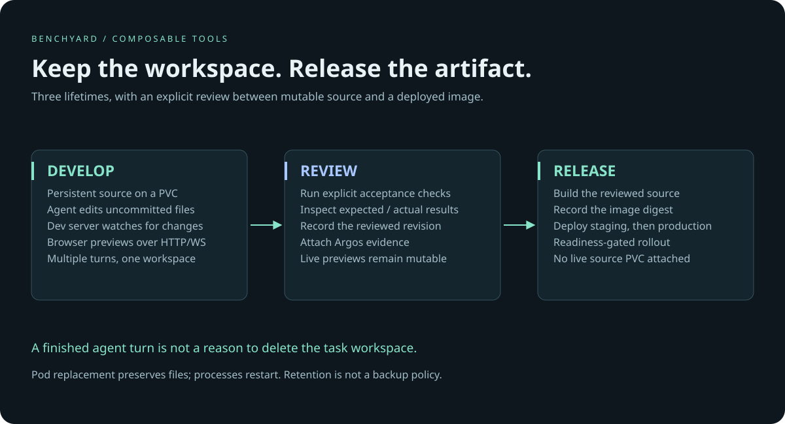

# Skheri

**Persistent cloud workspaces. Preview before commit. Deploy the same build across environments.**

[](https://github.com/benchyard/skheri/actions/workflows/ci.yml)
[](LICENSE)

[Quickstart](#try-it) · [Agent skill](SKILL.md) · [Environment contract](docs/contract.md) · [Operations](docs/operations.md) · [Product group](https://github.com/benchyard/stack)

Skheri gives a coding agent a repeatable environment without tying that environment
to one editor, Git host, or CI system. A development workspace keeps its source on
a persistent volume. An application release runs a built image. Both use ordinary
Kubernetes and Helm, on an existing single-node k3s installation or managed cluster.



## What works in 0.1

- **Persistent task workspace:** one release and PVC that can outlive multiple agent turns.
- **Uncommitted preview:** a Vite example with a running dev server and WebSocket HMR.
- **Independent releases:** a second chart deploys versioned images or image digests,
  with readiness checks and rolling updates.
- **Agent-readable contract:** explicit context, namespace, source, preview and cleanup
  rules; no proprietary control plane or new command language.

This first release is an environment kit. It does not include a mobile UI, team
session arbitration, cloud provisioning, automatic idle suspension, a hardened
multi-tenant sandbox, or a built-in Benchyard Worker adapter. A running cloud host
can continue working when your laptop is off; mobile task control comes from a
separately configured agent service or workbench.

## Try it

Requirements: an existing Kubernetes cluster with a default dynamic StorageClass,
Helm 3.14+, kubectl, and permission to create a dedicated namespace. Run these from
this repository. For a disposable local cluster, install [kind](https://kind.sigs.k8s.io/).
The integration test creates and deletes its own named kind cluster.

```bash
git clone https://github.com/benchyard/skheri.git
cd skheri
export SKHERI_CONTEXT=your-development-context

helm upgrade --install demo charts/workspace \
  --kube-context "$SKHERI_CONTEXT" --namespace skheri-demo --create-namespace \
  -f examples/environments/dev.yaml --wait --timeout 5m

# Copy only the supplied example, not your home directory or credentials.
tar -C examples/vite --exclude=node_modules --exclude=dist -cf - . | \
  kubectl --context "$SKHERI_CONTEXT" -n skheri-demo \
  exec -i deploy/demo -- tar -xf - -C /workspace/app

kubectl --context "$SKHERI_CONTEXT" -n skheri-demo \
  logs deploy/demo --follow
```

Once Vite is ready, open a second terminal:

```bash
kubectl --context "$SKHERI_CONTEXT" -n skheri-demo \
  port-forward svc/demo 5173:5173
```

Open <http://localhost:5173>. From another terminal, edit the source **in the pod**:

```bash
kubectl --context "$SKHERI_CONTEXT" -n skheri-demo exec deploy/demo -- \
  sed -i 's/Preview before commit./Live from your cloud workspace./g' /workspace/app/index.html
```

The browser refreshes without a Git commit or an image build. Kubernetes keeps the
workspace running; Vite implements hot reload. Local port-forwarding stops when
your terminal closes. For a phone-accessible cloud preview, configure authenticated
HTTPS ingress as described in [operations](docs/operations.md#cloud-preview).

## Deploy a build

Build and push `examples/vite/Dockerfile` using your own CI and registry. Record the
resulting digest; promote that **same digest** between environments:

```bash
helm upgrade --install demo-app charts/app \
  --kube-context "$SKHERI_CONTEXT" --namespace demo-staging --create-namespace \
  -f examples/environments/production.yaml \
  --set image.repository=ghcr.io/YOUR_ORG/demo \
  --set image.digest=sha256:YOUR_BUILD_DIGEST \
  --atomic --wait --timeout 5m
```

Use an image that supports a non-root user and listens on the configured port.
The workspace PVC is never attached to the deployed application. GitHub Actions,
GitLab CI and Acahti can run the same Helm command; none is a prerequisite.

## How it fits

| Component | Responsibility |
|---|---|
| [Benchyard](https://hero.benchyard.com/) | Tasks, people and agent execution |
| [Acahti](https://github.com/lpythu/acahti) | Optional Git, checks, packages and identity |
| **Skheri** | Persistent development workspace and application environments |
| [Argos](https://github.com/lpythu/argos) | Repeatable checks and reviewable evidence |

Start with one component. The [stack guide](https://github.com/benchyard/stack)
shows a composable workflow and distinguishes working commands from future integration.

## Validate and contribute

```bash
python3 -m unittest discover -s tests -v
python3 scripts/smoke.py   # requires Docker 28+, kind, Helm and kubectl
```

The smoke test checks a live uncommitted edit, source persistence after pod
replacement, the application chart, and PVC retention on uninstall. No existing
cluster is modified. See [CONTRIBUTING.md](CONTRIBUTING.md).

Apache-2.0. See [LICENSE](LICENSE) and [SECURITY.md](SECURITY.md).
